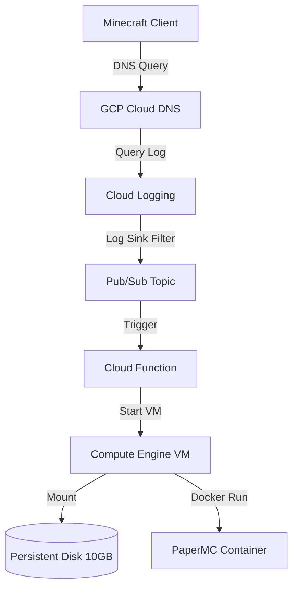

# 🎮 GCP Minecraft On-Demand (Scale-to-Zero)

[](https://ssh.cloud.google.com/cloudshell/open?cloudshell_git_repo=https://github.com/ARodrigue7/gcp-minecraft-ondemand.git&cloudshell_tutorial=cloudshell-tutorial.md)

An event-driven, cost-optimized infrastructure deployment that hosts a containerized Minecraft server on Google Cloud Platform (GCP). The architecture scales to **zero** compute usage when no players are online and automatically wakes up on-demand when a connection or DNS resolution is initiated.

This implementation acts as a cloud-native GCP equivalent to AWS on-demand server architectures, bringing down operational costs to a bare minimum (~$0.40/month for storage + ~$0.03/hour of active play).

---

## 🏗️ Architecture



1. **DNS Trigger**: When a player pings or resolves `play.yourdomain.com`, the request hits the delegated Google Cloud DNS zone.
2. **Event Router**: Cloud DNS query logging captures the resolution request. A **Cloud Logging Sink** filters this event and forwards it to a **Pub/Sub Topic**.
3. **Autostart Function**: Pub/Sub triggers a **Python Cloud Function** which checks the VM status. If the VM is stopped, it starts it and updates the Cloud DNS A-record to the new ephemeral external IP of the VM.
4. **Watchdog Shutdown**: A systemd watchdog timer runs on the Compute Engine instance. If no active TCP connections are detected on port `25565` for 10 minutes, the watchdog stops the VM gracefully, scaling compute costs back to zero.

---

## 🛠️ Prerequisites

Before deploying, ensure you have:
1. A **GCP Project** with billing enabled.
2. The **gcloud CLI** installed and authenticated (`gcloud auth application-default login`).
3. **Terraform** (>= 1.0) installed.
4. A domain name managed by **Cloudflare** (e.g., `yourdomain.com`).
5. A **Discord Webhook URL** (create this in Discord via `Server Settings` -> `Integrations` -> `Webhooks` -> `New Webhook`) to receive whitelist requests.

---

## 🚀 Setup & Deployment

The quickest way to deploy the entire stack is directly from your browser using Google Cloud Shell:

[](https://ssh.cloud.google.com/cloudshell/open?cloudshell_git_repo=https://github.com/ARodrigue7/gcp-minecraft-ondemand.git&cloudshell_tutorial=cloudshell-tutorial.md)

For detailed, step-by-step setup instructions, domain delegation configuration, and environment setup, please refer to:
* **Interactive Guide:** Visit the hosted [Getting Started Guide](https://arodrigue7.github.io/gcp-minecraft-ondemand/getting-started.html) on your GitHub Pages site.
* **Markdown Guide:** Read [tutorial.md](docs/tutorial.md) directly in this repository.

---

## 🛡️ Whitelisting & Administration

### 1. Player Portal (`docs/play.html`)
The player hub is a dedicated page for your community. It reads configuration dynamically to:
- Show a **Live Server Status** badge (`🟢 Online`, `🔴 Offline`, `🟡 Starting...`).
- Provide a **Copy Address** button to copy `mc.yourdomain.com` to the clipboard.
- Provide a **Whitelist Request** form.

#### One-Click Discord Approval Flow:
1. **Offline Status Check & Anti-Spam**: A player submits their username. The Cloud Function queries VM metadata attributes (`approved-whitelist` and `pending-whitelist`) even if the VM is shut down.
   - If they are already approved, they receive a prompt: *"Username is already whitelisted!"*
   - If their request is already pending, they receive a prompt: *"Whitelist request is already pending approval."* This prevents duplicate spamming of the Discord webhook.
2. **Discord Notification**: The Cloud Function securely posts a rich message embed to your Discord channel.
3. **One-Click Actions**:
   - **🟢 Approve Request Link**: Click this link in the embed. The Cloud Function verifies the secure HMAC signature, appends the player to `approved-whitelist`, removes them from `pending-whitelist`, and **automatically deletes the webhook alert message from Discord** to keep your channel clean.
   - **🔴 Deny & Dismiss Link**: Click this to reject the request. The Cloud Function removes the player from `pending-whitelist` and deletes the alert message from Discord immediately.

### 2. RCON Watchdog Player Check
Instead of checking raw TCP connection sockets (which can be tricked into keeping the VM online by automated server lists, scanner bots, or simple TCP pings), the watchdog script uses the Minecraft RCON client to query the exact player count (`rcon-cli list`). If the active player count remains at `0` for your configured timeout (default `600` seconds / 10 minutes), the VM is shut down gracefully.

---

## 💾 Backing up & Restoring Saves

This repository includes helper scripts to easily upload and download your world data to and from the GCP instance. You will need to install the [Google Cloud CLI](https://cloud.google.com/sdk/docs/install) before running them.

### Download World Data from Server
Downloads the current Minecraft world from the cloud to your local `saves/` directory.
* **Mac/Linux:** `./scripts/linux/download-saves.sh`
* **Windows (PowerShell):** `.\scripts\windows\download-saves.ps1`

### Upload Local World Data to Server
Uploads your local files in the `saves/` directory back up to the cloud.
* **Mac/Linux:** `./scripts/linux/upload-saves.sh`
* **Windows (PowerShell):** `.\scripts\windows\upload-saves.ps1`

---

## 🧪 Testing

We have built a comprehensive mock test suite using `pytest` to test all Cloud Function endpoint flows, authentication logic, whitelist metadata management, and DNS updates locally without needing live GCP credentials.

To install dependencies and run the tests:
```bash
# Install dependencies
pip3 install -r functions/requirements.txt

# Run the test suite
cd functions
python3 -m pytest tests/ -v
```

---

## ⚙️ Customization

You can customize the Minecraft server settings by editing [terraform/startup.sh](terraform/startup.sh).
* `TYPE`: Change from `PAPER` to `VANILLA`, `FORGE`, `FABRIC`, etc.
* `VERSION`: Set a specific version like `1.20.4` instead of `LATEST`.
* `MEMORY`: Change the JVM memory allocation (e.g., `3G`).

---

## 📝 License

This project is licensed under the MIT License. See the [LICENSE](LICENSE) file for details.
