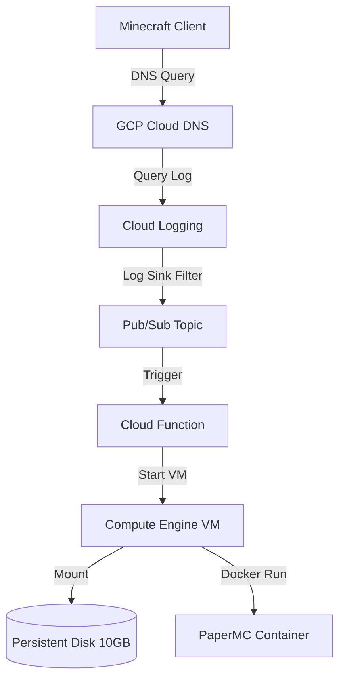

# 🎮 GCP Minecraft On-Demand (Scale-to-Zero)

An event-driven, cost-optimized infrastructure deployment that hosts a containerized Minecraft server on Google Cloud Platform (GCP). The architecture scales to **zero** compute usage when no players are online and automatically wakes up on-demand when a connection or DNS resolution is initiated.

This implementation acts as a cloud-native GCP equivalent to AWS on-demand server architectures, bringing down operational costs to a bare minimum (~$0.40/month for storage + ~$0.03/hour of active play).

---

## 🏗️ Architecture



1. **DNS Trigger**: When a player pings or resolves `play.yourdomain.com`, the request hits the delegated Google Cloud DNS zone.
2. **Event Router**: Cloud DNS query logging captures the resolution request. A **Cloud Logging Sink** filters this event and forwards it to a **Pub/Sub Topic**.
3. **Autostart Function**: Pub/Sub triggers a **Python Cloud Function** which checks the VM status. If the VM is stopped, it starts it and updates the Cloud DNS A-record to the new ephemeral external IP of the VM.
4. **Watchdog Shutdown**: A systemd watchdog timer runs on the Compute Engine instance. If no active TCP connections are detected on port `25565` for 10 minutes, the watchdog stops the VM gracefully, scaling compute costs back to zero.

---

## 🛠️ Prerequisites

Before deploying, ensure you have:
1. A **GCP Project** with billing enabled.
2. The **gcloud CLI** installed and authenticated (`gcloud auth application-default login`).
3. **Terraform** (>= 1.0) installed.
4. A domain name managed by **Cloudflare** (e.g., `yourdomain.com`).
5. A **Discord Webhook URL** (create this in Discord via `Server Settings` -> `Integrations` -> `Webhooks` -> `New Webhook`) to receive whitelist requests.

---

## 🚀 Setup & Deployment

### Phase 1: Google Cloud Platform (GCP) Preparation

#### 1. Enable Required APIs
Run the following command using the `gcloud` CLI to enable the necessary APIs in your GCP project:
```bash
gcloud services enable \
  compute.googleapis.com \
  dns.googleapis.com \
  pubsub.googleapis.com \
  logging.googleapis.com \
  cloudfunctions.googleapis.com \
  cloudbuild.googleapis.com \
  artifactregistry.googleapis.com
```

#### 2. Authenticate Local Environment
Ensure your local terminal has Application Default Credentials configured so Terraform can deploy resources:
```bash
gcloud auth application-default login
```

---

### Phase 2: Configure & Apply Terraform

#### 1. Set Up Variables
Copy the example variables file to your active configuration:
```bash
cp terraform/terraform.tfvars.example terraform/terraform.tfvars
```

Open `terraform/terraform.tfvars` and configure the values:
* `project_id`: Your actual GCP Project ID (e.g., `minecraft-ondemand-499002`).
* `domain_name`: The subdomain players will use (e.g., `mc.yourdomain.com`).
* `dns_zone_name`: Logical name for the zone inside GCP (e.g., `mc-yourdomain-com`).
* `discord_webhook_url`: Your private Discord Webhook URL.
* `idle_timeout_seconds`: Inactivity seconds before auto-shutdown (e.g., `600` for 10 minutes).

#### 2. Deploy Infrastructure
Navigate to the `terraform/` directory, initialize, and deploy the infrastructure:
```bash
cd terraform
terraform init
terraform apply
```
When prompted, type `yes` to confirm.

> [!NOTE]
> Upon successful application, Terraform automatically creates the configuration file **`docs/config.js`** for your website and prints the assigned DNS name servers to your console.

```text
Outputs:
dns_name_servers = [
  "ns-cloud-c1.googledomains.com.",
  "ns-cloud-c2.googledomains.com.",
  "ns-cloud-c3.googledomains.com.",
  "ns-cloud-c4.googledomains.com."
]
status_function_url = "https://us-central1-..."
```
**Keep these name servers handy for the next phase!**

---

### Phase 3: Cloudflare DNS Delegation

To let GCP intercept DNS requests and trigger the server wake-up sequence, delegate the subdomain (e.g., `mc.yourdomain.com`) to Google Cloud DNS. Cloudflare will continue managing your root domain (`yourdomain.com`), but resolves the subdomain through GCP.

1. Log in to your **Cloudflare Dashboard**.
2. Click on your domain (e.g., `yourdomain.com`).
3. Click on **DNS** -> **Records** in the left sidebar.
4. Create **four (4) NS Records**, one for each name server provided by your Terraform output.

For each record:
* **Type**: `NS`
* **Name**: The subdomain prefix (e.g., `mc`).
* **Nameserver**: A Google name server (e.g., `ns-cloud-c1.googledomains.com.`).
* **TTL**: Auto / Default.

> [!WARNING]
> Do NOT create an `A` record on Cloudflare for `mc.yourdomain.com`. Cloudflare must delegate the entire DNS resolution of `mc.yourdomain.com` to GCP DNS so the query logs can trigger the Cloud Function.

---

### Phase 4: How to Test the Flow

1. **Ping the Subdomain:**
   Open a terminal and run `ping mc.yourdomain.com` or launch Minecraft and add the server.
2. **First Resolution:**
   Initially, the ping might timeout. Behind the scenes, GCP's Logging Sink detects the resolution query and triggers the `minecraft-starter` Cloud Function.
3. **VM Startup:**
   The function powers on the GCE VM, retrieves the external IP, and updates GCP Cloud DNS.
4. **Connect:**
   Within 10–20 seconds, re-ping or refresh Minecraft. The subdomain resolves to the VM's public IP, and you can join!
5. **Scale-to-Zero:**
   Once everyone logs off and the server is idle for 10 minutes, the watchdog shuts down the instance automatically to eliminate compute charges.

---

## 🛡️ Whitelisting & Administration

### 1. Enable Whitelisting
Whitelisting is enabled by default in this deployment (pre-configured with `-e ENABLE_WHITELIST=TRUE` and `-e ENFORCE_WHITELIST=TRUE` in the container startup configuration). You do not need to perform any manual VM configurations to enable it.

### 2. Player Portal (`docs/play.html`)
The player hub is a dedicated page for your community. It reads the configuration dynamically to:
- Show a **Live Server Status** badge (`🟢 Online`, `🔴 Offline`, `🟡 Starting...`).
- Provide a **Copy Address** button to copy `mc.yourdomain.com` to the clipboard.
- Provide a **Whitelist Request** form.

#### Whitelist Request, Offline Checks, & One-Click Approval Flow:
1. **Offline Status Check & Anti-Spam**: A player enters their Minecraft username on the Player Portal and clicks **Submit**. The Cloud Function queries the VM's metadata attributes (`approved-whitelist` and `pending-whitelist`) even if the VM is shut down.
   - If they are already approved, they receive a prompt: *"Username is already whitelisted!"*
   - If their request is already pending, they receive a prompt: *"Whitelist request is already pending approval."* This prevents threat actors from spamming the Discord webhook.
   - If it is a new request, they are added to `pending-whitelist` and the Discord notification is sent.
2. **Discord Notification**: The Cloud Function securely posts a rich message embed to your Discord channel.
3. **One-Click Actions**:
   - **🟢 Approve Request Link**: Click this link in the embed. The Cloud Function verifies the secure HMAC signature, appends the player to `approved-whitelist`, removes them from `pending-whitelist`, and **automatically deletes the webhook alert message from Discord** to keep your channel clean.
   - **🔴 Deny & Dismiss Link**: Click this to reject the request. The Cloud Function removes the player from `pending-whitelist` and deletes the alert message from Discord immediately.
   - **Manual SSH Command**: Copy/paste the pre-formatted command:
     ```bash
     gcloud compute ssh minecraft-server --zone=us-central1-a --command="docker exec minecraft rcon-cli whitelist add <username>"
     ```


### 3. RCON Watchdog Player Check
Instead of checking raw TCP connection sockets (which can be tricked into keeping the VM online by automated server lists, scanner bots, or simple TCP pings), the watchdog script uses the Minecraft RCON client to query the exact player count (`rcon-cli list`). If the active player count remains at `0` for your configured timeout (default `600` seconds / 10 minutes), the VM is shut down gracefully.

#### 🌐 Dynamic Configuration for Cloners/Forks:
If other developers clone or fork this project, they do not need to rebuild or host their own website to test the player portal. They can pass their variables directly in the URL:
```text
https://your-username.github.io/gcp-minecraft-ondemand/play.html?api=https://YOUR_FUNCTION_URL&domain=YOUR_DOMAIN
```
Visiting this link **once** will automatically save the custom `api` and `domain` parameters to the browser's `localStorage` and persist them for all future visits! Otherwise, the page defaults to reading the local `docs/config.js`.

---

## 💾 Backing up & Restoring Saves

This repository includes helper scripts to easily upload and download your world data to and from the GCP instance. You will need to install the [Google Cloud CLI](https://cloud.google.com/sdk/docs/install) before running them.

### Download World Data from Server
Downloads the current Minecraft world from the cloud to your local `saves/` directory.
* **Mac/Linux:** `./scripts/download-saves.sh`
* **Windows (PowerShell):** `.\scripts\download-saves.ps1`

### Upload Local World Data to Server
Uploads your local files in the `saves/` directory back up to the cloud.
* **Mac/Linux:** `./scripts/upload-saves.sh`
* **Windows (PowerShell):** `.\scripts\upload-saves.ps1`

---

## ⚙️ Customization

You can customize the Minecraft server settings by editing [terraform/startup.sh](terraform/startup.sh).
* `TYPE`: Change from `PAPER` to `VANILLA`, `FORGE`, `FABRIC`, etc.
* `VERSION`: Set a specific version like `1.20.4` instead of `LATEST`.
* `MEMORY`: Change the JVM memory allocation (e.g., `3G`).

### 🌐 Dynamic DNS Configuration
By default, this project uses **Google Cloud DNS** (`dns_provider = "google"`) to handle domain resolution and automatic IP updates on server boot. However, you can configure alternative providers in `terraform/terraform.tfvars`:

* **Cloudflare** (`dns_provider = "cloudflare"`):
  - Set `domain_name` to your subdomain (e.g., `mc.yourdomain.com`).
  - Set `dns_api_token` to a Cloudflare API token (with Zone.DNS edit permissions).
  - Set `cloudflare_zone_id` to your Cloudflare zone ID.
* **DuckDNS** (`dns_provider = "duckdns"`):
  - Set `domain_name` to your DuckDNS domain (e.g., `yoursubdomain.duckdns.org`).
  - Set `dns_api_token` to your DuckDNS token.
* **Dynu DNS** (`dns_provider = "dynu"`):
  - Set `domain_name` to your Dynu hostname (e.g., `yourdomain.dynu.com`).
  - Set `dns_api_token` to your Dynu IP update credential (API token or password).
* **None** (`dns_provider = "none"`):
  - Disables automatic dynamic DNS updates. Useful if you want to manage DNS updates manually.

---

## 🔮 Future Roadmap

* **Deploy to Google Cloud Button**: Introduce a secure, interactive setup wizard within Google Cloud Shell (via the standard `Deploy to GCP` button) to automate project provisioning and eliminate manual local file creation.

---

## 📝 License

This project is licensed under the MIT License. See the [LICENSE](LICENSE) file for details.
