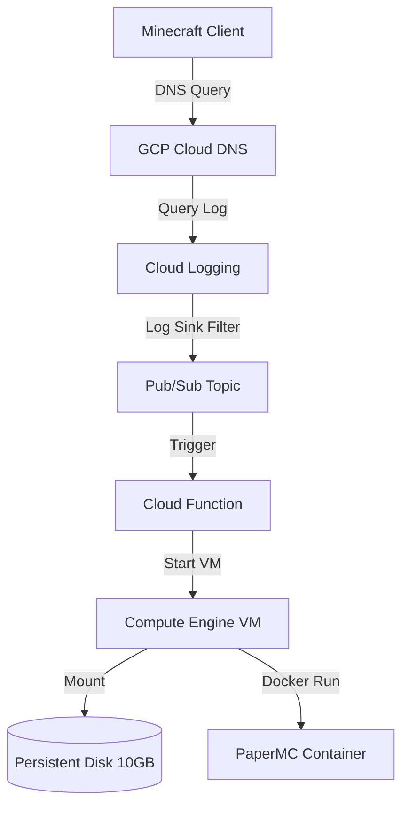

# 🎮 GCP Minecraft On-Demand (Scale-to-Zero)

An event-driven, cost-optimized infrastructure deployment that hosts a containerized Minecraft server on Google Cloud Platform (GCP). The architecture scales to **zero** compute usage when no players are online and automatically wakes up on-demand when a connection or DNS resolution is initiated.

This implementation acts as a cloud-native GCP equivalent to AWS on-demand server architectures, bringing down operational costs to a bare minimum (~$0.40/month for storage + ~$0.03/hour of active play).

---

## 🏗️ Architecture



1. **DNS Trigger**: When a player pings or resolves `play.yourdomain.com`, the request hits the delegated Google Cloud DNS zone.
2. **Event Router**: Cloud DNS query logging captures the resolution request. A **Cloud Logging Sink** filters this event and forwards it to a **Pub/Sub Topic**.
3. **Autostart Function**: Pub/Sub triggers a **Python Cloud Function** which checks the VM status. If the VM is stopped, it starts it and updates the Cloud DNS A-record to the new ephemeral external IP of the VM.
4. **Watchdog Shutdown**: A systemd watchdog timer runs on the Compute Engine instance. If no active TCP connections are detected on port `25565` for 10 minutes, the watchdog stops the VM gracefully, scaling compute costs back to zero.

---

## 🛠️ Prerequisites

Before deploying, ensure you have:
1. A **GCP Project** with billing enabled.
2. The **gcloud CLI** installed and authenticated (`gcloud auth application-default login`).
3. **Terraform** (>= 1.0) installed.
4. A domain name managed by **Cloudflare** (e.g., `yourdomain.com`).

---

## 🚀 Setup & Deployment

### Step 1: Clone the Repository
```bash
git clone https://github.com/your-username/gcp-ondemand-minecraft.git
cd gcp-ondemand-minecraft
```

### Step 2: Configure Terraform Variables
Create a `terraform/terraform.tfvars` file to specify your custom variables:
```hcl
project_id           = "your-gcp-project-id"
domain_name          = "play.yourdomain.com"
dns_zone_name        = "play-yourdomain-com"
idle_timeout_seconds = 600   # Stop VM after 10 minutes of inactivity
machine_type         = "e2-medium"
disk_size_gb         = 10
```

### Step 3: Deploy with Terraform
Navigate to the `terraform/` directory, initialize, and deploy the infrastructure:
```bash
cd terraform
terraform init
terraform plan
terraform apply
```
*Note down the `dns_name_servers` output list upon successful application.*

### Step 4: Delegate Subdomain from Cloudflare
To route requests through Cloud DNS for logging, you need to delegate the subdomain (e.g., `play.yourdomain.com`) to GCP:
1. Log in to your **Cloudflare Dashboard**.
2. Select your domain (`yourdomain.com`) and go to the **DNS** settings.
3. Add four new **NS Records** for the subdomain name (e.g., `play`):
   * **Type**: `NS`
   * **Name**: `play`
   * **Content**: The GCP name servers from the Terraform output (e.g., `ns-cloud-c1.googledomains.com.`, etc.). Ensure you add one record for each of the four name servers.
   * **TTL**: Auto / Default.

---

## ⚙️ Customization

You can customize the Minecraft server settings by editing [terraform/startup.sh](file:///Volumes/Dev%20Drive/gcp-ondemand-minecraft/terraform/startup.sh).

By default, the server is running **PaperMC** (highly optimized for performance and RAM). You can change this by modifying the container environment variables in `startup.sh`:
* `TYPE`: change from `PAPER` to `VANILLA`, `FORGE`, `FABRIC`, etc.
* `VERSION`: set a specific version like `1.20.4` instead of `LATEST`.
* `MEMORY`: change the JVM memory allocation (e.g., `3G`).

---

## 📝 License

This project is licensed under the MIT License. See the [LICENSE](file:///Volumes/Dev%20Drive/gcp-ondemand-minecraft/LICENSE) file for details.
