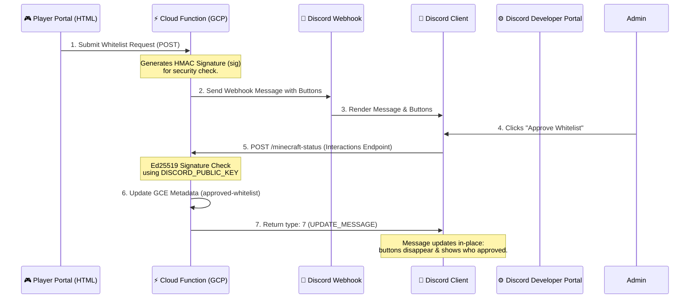

# 🤖 Discord Bot Interactive Buttons Setup Guide

This guide walks you through configuring a Discord Application to enable the **interactive buttons** (Approve / Deny) on your server's whitelist notifications. 

Currently, you are using outbound Webhooks, which display the buttons but show "Interaction Failed" when clicked because Discord doesn't know where to send the click events. By setting up a Discord Application and hooking it to your Google Cloud Function, these buttons will process approvals instantly in-place!

---

## 🔍 How It Works (The Hybrid Flow)



---

## 🛠️ Step-by-Step Setup

### Step 1: Create a Discord Application
1. Go to the [Discord Developer Portal](https://discord.com/developers/applications) and log in with your Discord account.
2. Click **New Application** in the top-right corner.
3. Give your application a name (e.g., `GCP Minecraft Watchdog`) and accept the Developer Terms.
4. On the **General Information** page, locate the **Public Key** field.
5. **Copy the Public Key value** (this is a long hexadecimal string). You will need this for Terraform.

---

### Step 2: Configure & Deploy the Public Key in Terraform
Discord validates interaction endpoint URLs using a cryptographically signed signature (Ed25519). The Cloud Function uses your app's Public Key to verify that requests actually come from Discord. 

> [!IMPORTANT]
> You **must** deploy the Public Key to Google Cloud *before* registering the endpoint in the Discord Developer Portal, as Discord will send a verification ping when you save the URL.

1. Open your local `terraform/terraform.tfvars` file.
2. Add or update the `discord_public_key` variable with your application's public key:
   ```hcl
   discord_public_key = "PASTE_YOUR_DISCORD_APPLICATION_PUBLIC_KEY_HERE"
   ```
3. Open a terminal, navigate to your `terraform/` directory, and apply the configuration:
   ```bash
   terraform apply
   ```
4. Verify that the changes successfully apply. Take note of the **`status_function_url`** in the outputs:
   ```text
   status_function_url = "https://us-central1-minecraft-ondemand-499002.cloudfunctions.net/minecraft-status"
   ```

---

### Step 3: Register the Interactions Endpoint URL
Now that your Cloud Function is updated with your Discord application's public key, it is ready to respond to Discord's verification checks.

1. Return to the [Discord Developer Portal](https://discord.com/developers/applications) and open your application.
2. Go to the **General Information** tab.
3. Find the **Interactions Endpoint URL** field.
4. Paste your GCF **`status_function_url`** into this field.
5. Scroll down and click **Save Changes**.
   
> [!TIP]
> **Did it save successfully?**
> - **Yes:** Your signature verification logic is fully operational!
> - **Error "Invalid Interactions Endpoint URL":** Make sure `discord_public_key` in your `terraform.tfvars` matches the Portal's public key, and that your `terraform apply` succeeded. Also, double-check that you copied the correct GCF status URL.

---

### Step 4: Invite the Bot to Your Server
To let Discord map the interactive buttons and payloads to your server, you need to authorize the application on your server.

1. In the Developer Portal, navigate to the **OAuth2** tab in the sidebar, then select **URL Generator**.
2. Under **Scopes**, check the following boxes:
   - `bot`
   - `applications.commands`
3. Under **Bot Permissions**, you don't need any permissions for basic button responses (since GCF updates messages via webhooks or HTTP returns), but you can optionally select `Send Messages` and `Embed Links`.
4. Copy the generated **OAuth2 URL** at the bottom of the page.
5. Paste this URL into a new browser tab, select your Discord server, and click **Authorize**.

---

### Step 5: Test Your Interactions!
Your configuration is complete! Let's run a test verification:

1. Open your Player Portal website (`play.html`).
2. Type in a Minecraft username and click **Submit**.
3. Go to your Discord channel. You should see a webhook message containing the **Approve Whitelist** and **Deny** buttons.
4. Click **Approve Whitelist**.
5. The buttons will immediately disappear, and the message will update in-place:
   > ✓ **[Username]** has been approved and whitelisted by **@[YourDiscordUsername]**!
6. Behind the scenes, GCF has added the player to the GCE VM's `approved-whitelist` metadata, which the watchdog script will sync onto the active server within 60 seconds.

---

## 🔍 Troubleshooting & FAQs

### Q: Why does it say "Interaction Failed" on the buttons?
- **Root Cause 1:** The **Interactions Endpoint URL** is not set in the Developer Portal, or was not saved correctly.
- **Root Cause 2:** The bot application has not been invited/authorized to the specific server where the webhook is sending messages.
- **Root Cause 3:** GCF failed to verify the signature. Check the Cloud Function logs in GCP console for any traceback related to `BadSignatureError`.

### Q: Can I still use the hyperlink in the embed?
Yes! In case your bot endpoint is ever down, the embed contains a fallback link: `[🟢 Click here to Approve Whitelist]`. Clicking this opens a browser tab that uses GCF's standard GET handler to approve the user and clean up the message.
